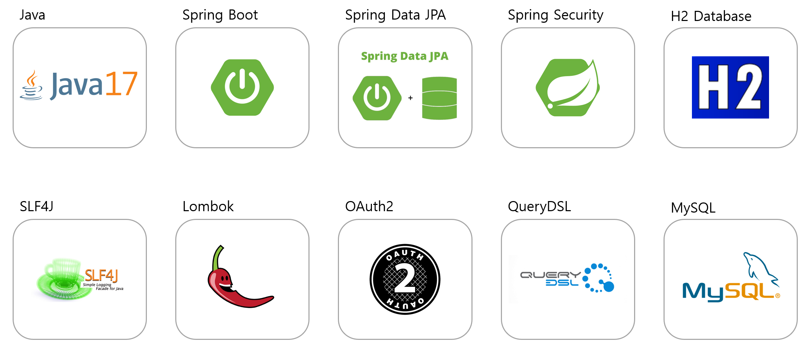
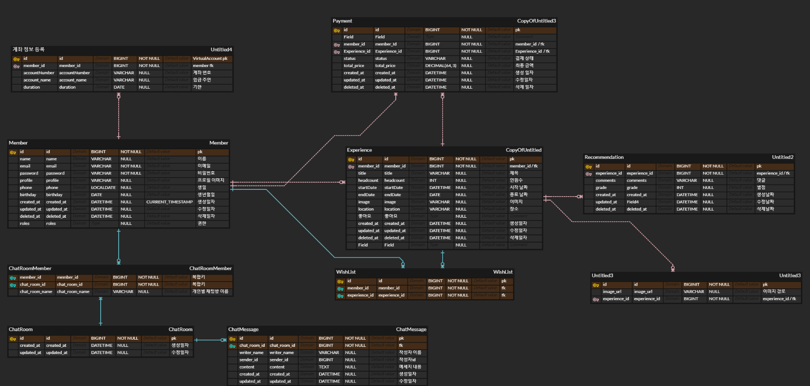

## 멤버
### Backend

|                                                  전화철                                                   |                                                  김재형                                                  |                                                   박태훈                                                   |                                                  이유진                                                  |                                                  정용화                                                   |                                                  황중석                                                   |
|:------------------------------------------------------------------------------------------------------:|:-----------------------------------------------------------------------------------------------------:|:-------------------------------------------------------------------------------------------------------:|:-----------------------------------------------------------------------------------------------------:|:------------------------------------------------------------------------------------------------------:|:------------------------------------------------------------------------------------------------------:|
|  |  |  |  |  |  |
|                                 [J-Cheol](https://github.com/J-Cheol)                                  |                               [himari7](https://github.com/himari7)                               |                                  [pth2134](https://github.com/pth2134)                                  |                                   [UJIN901](https://github.com/UJIN901)                                   |                                  [jyh1108](https://github.com/jyh1108)                                   |                                                  [snow4ram](https://github.com/snow4ram)                                                  |

## 기술스택
### Frontend

### Backend

### Infra

## ERD

## 패키지 구조

 FeelKo

<pre><code>
📦feelKo
 ┣ 📂domain
 ┃ ┣ 📂chat
 ┃ ┃ ┣ 📂chatMessage
 ┃ ┃ ┃ ┣ 📂api
 ┃ ┃ ┃ ┃ ┣ 📂request
 ┃ ┃ ┃ ┃ ┗ 📂response
 ┃ ┃ ┃ ┣ 📂entity
 ┃ ┃ ┃ ┣ 📂repository
 ┃ ┃ ┃ ┗ 📂service
 ┃ ┃ ┗ 📂chatRoom
 ┃ ┃ ┃ ┣ 📂controller
 ┃ ┃ ┃ ┃ ┗ 📂request
 ┃ ┃ ┃ ┣ 📂dto
 ┃ ┃ ┃ ┣ 📂entity
 ┃ ┃ ┃ ┣ 📂repository
 ┃ ┃ ┃ ┗ 📂service
 ┃ ┣ 📂comment
 ┃ ┃ ┗ 📂entity
 ┃ ┣ 📂experience
 ┃ ┃ ┣ 📂api
 ┃ ┃ ┣ 📂application
 ┃ ┃ ┣ 📂dao
 ┃ ┃ ┣ 📂dto
 ┃ ┃ ┣ 📂entity
 ┃ ┃ ┗ 📂form
 ┃ ┣ 📂main
 ┃ ┃ ┣ 📂api
 ┃ ┃ ┗ 📂application
 ┃ ┣ 📂member
 ┃ ┃ ┣ 📂api
 ┃ ┃ ┃ ┗ 📂Request
 ┃ ┃ ┣ 📂application
 ┃ ┃ ┣ 📂dao
 ┃ ┃ ┣ 📂dto
 ┃ ┃ ┗ 📂entity
 ┃ ┣ 📂payment
 ┃ ┃ ┣ 📂api
 ┃ ┃ ┃ ┣ 📂response
 ┃ ┃ ┃ ┗ 📂reuqest
 ┃ ┃ ┣ 📂application
 ┃ ┃ ┣ 📂dao
 ┃ ┃ ┣ 📂dto
 ┃ ┃ ┗ 📂entity
 ┃ ┗ 📂wishlist
 ┃ ┃ ┣ 📂api
 ┃ ┃ ┣ 📂application
 ┃ ┃ ┣ 📂dao
 ┃ ┃ ┣ 📂dto
 ┃ ┃ ┗ 📂entity
 ┣ 📂global
 ┃ ┣ 📂common
 ┃ ┃ ┗ 📂entity
 ┃ ┣ 📂init
 ┃ ┣ 📂security
 ┃ ┗ 📂websocket
</code></pre>

