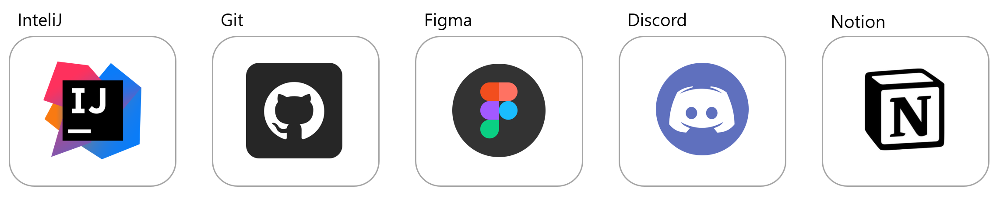
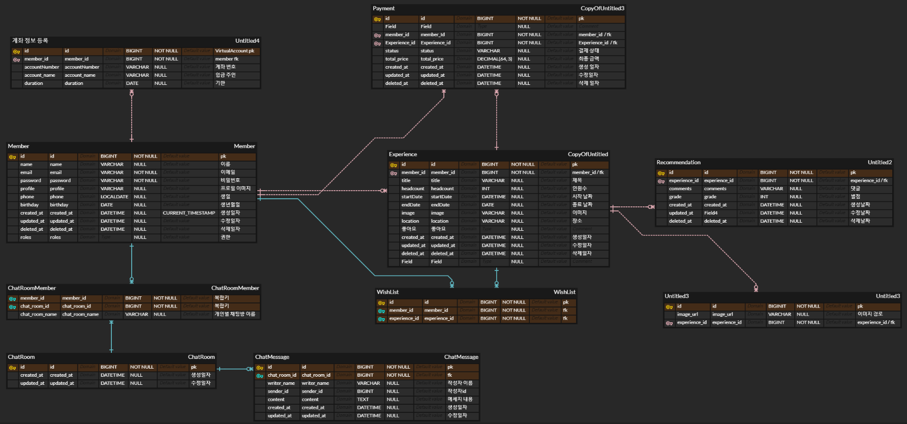

## 멤버
### Backend

|                                                  전화철                                                   |                                                  김재형                                                  |                                                   박태훈                                                   |                                                  이유진                                                  |                                                  정용화                                                   |                                                  황중석                                                   |
|:------------------------------------------------------------------------------------------------------:|:-----------------------------------------------------------------------------------------------------:|:-------------------------------------------------------------------------------------------------------:|:-----------------------------------------------------------------------------------------------------:|:------------------------------------------------------------------------------------------------------:|:------------------------------------------------------------------------------------------------------:|
|  |  |  |  |  |  |
|                                 [J-Cheol](https://github.com/J-Cheol)                                  |                               [himari7](https://github.com/himari7)                               |                                  [pth2134](https://github.com/pth2134)                                  |                                   [UJIN901](https://github.com/UJIN901)                                   |                                  [jyh1108](https://github.com/jyh1108)                                   |                                                  [snow4ram](https://github.com/snow4ram)                                                  |

## 기술스택
### Frontend

### Backend

### Tool

## Commit Convention
| 타입            | 설명                                          | 예시 커밋 메시지                        |
|----------------|----------------------------------------------|----------------------------------|
| feat           | 새로운 기능 추가                              | `feat: 새 로그인 기능 구현`              |
| fix            | 버그 수정                                    | `fix: 사용자 인증 버그 수정`              |
| hotfix         | 치명적 버그 긴급 수정                          | `hotfix: 서버 다운 이슈 해결`            |
| breaking change | 중대한 API 변경                              | `breaking change: API 엔드포인트 변경`  |
| refactor       | 코드 리팩토링                                 | `refactor: 서비스 클래스 코드 정리`        |
| perf           | 성능 개선                                    | `perf: 이미지 로딩 속도 개선`             |
| comment        | 주석 추가하거나 변경                            | `docs: 함수 설명 주석 추가`              |
| style          | 코드 스타일 변경 (코드 포맷팅, 세미콜론 누락 등) | `style: 세미콜론 누락`                 |
| design         | 사용자 UI 디자인 변경 (CSS 등)                 | `design: 헤더 컴포넌트 스타일 업데이트`       |
| test           | 테스트 코드, 리팩토링 테스트 코드 추가          | `test: 새 사용자 등록 테스트 케이스 추가`      |
| build          | 빌드 파일 수정                                | `build: Webpack 설정 업데이트`         |
| chore          | 빌드 업무 수정, 패키지 매니저 설정 (gitignore 수정 등) | `chore: 의존성 업데이트 및 gitignore 수정` |
| ci             | CI 설정 파일 수정                             | `ci: Travis CI 스크립트 수정`          |
| docs           | 문서 수정                                    | `docs: README 파일 업데이트`           |
| rename         | 파일 혹은 폴더 명을 수정                        | `rename: 클래스 파일명 변경`             |
| remove         | 파일 삭제                                    | `remove: 사용하지 않는 컴포넌트 파일 삭제`     |

## ERD

## 패키지 구조

 FeelKo

<pre><code>
📦feelKo
 ┣ 📂domain
 ┃ ┣ 📂chat
 ┃ ┃ ┣ 📂chatMessage
 ┃ ┃ ┃ ┣ 📂api
 ┃ ┃ ┃ ┃ ┣ 📂request
 ┃ ┃ ┃ ┃ ┗ 📂response
 ┃ ┃ ┃ ┣ 📂entity
 ┃ ┃ ┃ ┣ 📂repository
 ┃ ┃ ┃ ┗ 📂service
 ┃ ┃ ┗ 📂chatRoom
 ┃ ┃ ┃ ┣ 📂controller
 ┃ ┃ ┃ ┃ ┗ 📂request
 ┃ ┃ ┃ ┣ 📂dto
 ┃ ┃ ┃ ┣ 📂entity
 ┃ ┃ ┃ ┣ 📂repository
 ┃ ┃ ┃ ┗ 📂service
 ┃ ┣ 📂comment
 ┃ ┃ ┗ 📂entity
 ┃ ┣ 📂experience
 ┃ ┃ ┣ 📂api
 ┃ ┃ ┣ 📂application
 ┃ ┃ ┣ 📂dao
 ┃ ┃ ┣ 📂dto
 ┃ ┃ ┣ 📂entity
 ┃ ┃ ┗ 📂form
 ┃ ┣ 📂main
 ┃ ┃ ┣ 📂api
 ┃ ┃ ┗ 📂application
 ┃ ┣ 📂member
 ┃ ┃ ┣ 📂api
 ┃ ┃ ┃ ┗ 📂Request
 ┃ ┃ ┣ 📂application
 ┃ ┃ ┣ 📂dao
 ┃ ┃ ┣ 📂dto
 ┃ ┃ ┗ 📂entity
 ┃ ┣ 📂payment
 ┃ ┃ ┣ 📂api
 ┃ ┃ ┃ ┣ 📂response
 ┃ ┃ ┃ ┗ 📂reuqest
 ┃ ┃ ┣ 📂application
 ┃ ┃ ┣ 📂dao
 ┃ ┃ ┣ 📂dto
 ┃ ┃ ┗ 📂entity
 ┃ ┗ 📂wishlist
 ┃ ┃ ┣ 📂api
 ┃ ┃ ┣ 📂application
 ┃ ┃ ┣ 📂dao
 ┃ ┃ ┣ 📂dto
 ┃ ┃ ┗ 📂entity
 ┣ 📂global
 ┃ ┣ 📂common
 ┃ ┃ ┗ 📂entity
 ┃ ┣ 📂init
 ┃ ┣ 📂security
 ┃ ┗ 📂websocket
</code></pre>

